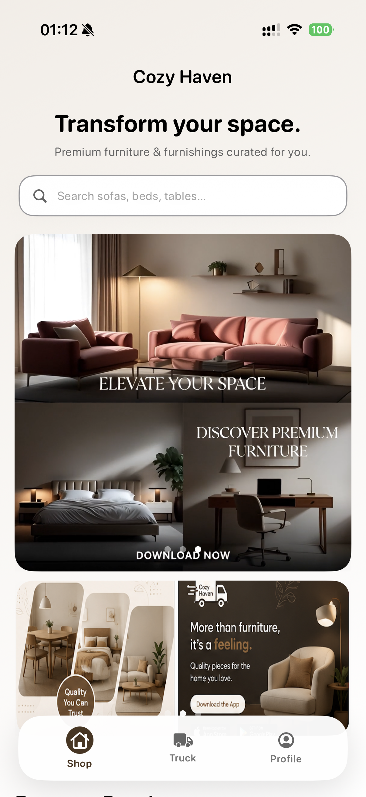
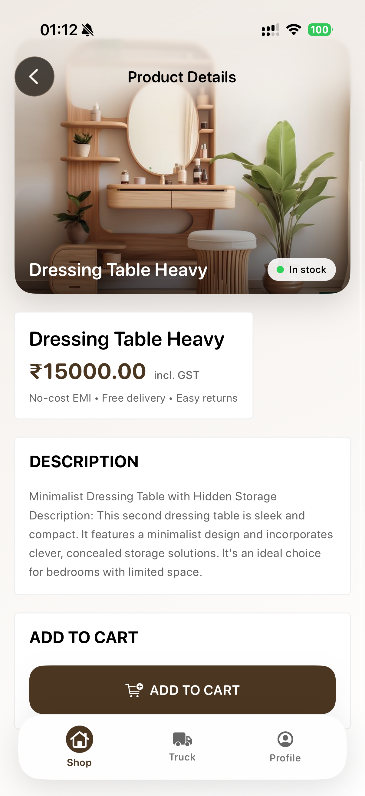
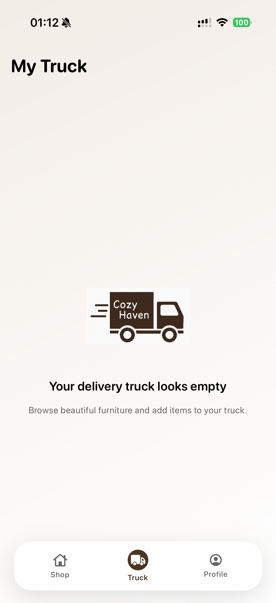
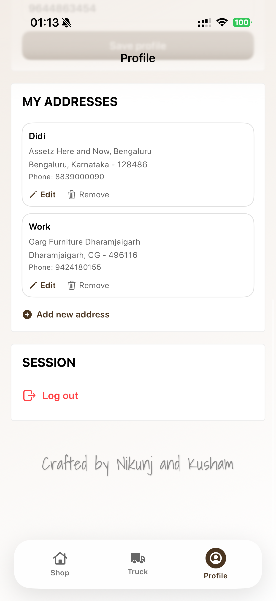
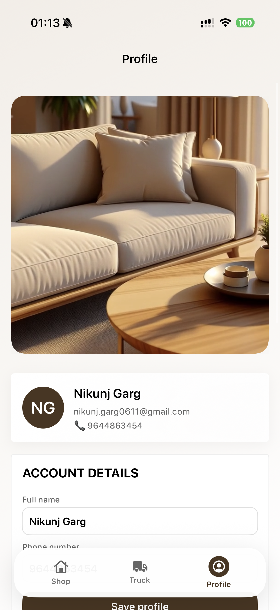

# 🛋️ Cozy Haven – Furniture E-Commerce iOS App

A modern iOS furniture shopping application built using **SwiftUI**, **Firebase**, and **Razorpay**. The app provides a smooth shopping experience with premium UI, secure authentication, address management, and online payment integration.

---

## ✨ Features

- 🔐 User Authentication (Firebase Authentication)
- 🛋️ Browse premium furniture products
- 🔍 Product details with high-quality images
- 🛒 Add to Cart functionality
- 📍 Address Book Management
- 💳 Razorpay Payment Integration
- 🎥 Premium video carousel banners
- 🖼️ Promotional image banners
- ⚡ Smooth SwiftUI animations
- ☁️ Firebase Firestore database integration
- 🖼️ Firebase Storage for product images
- 📱 Modern and responsive iOS interface

---

## 🛠️ Tech Stack

- SwiftUI
- Firebase Authentication
- Cloud Firestore
- Firebase Storage
- Razorpay SDK
- CocoaPods
- Xcode
- iOS

---

## 📸 Screenshots

  
  
  

  
  
  

  

---

---

## 🔒 Note

The repository does **not** include sensitive configuration files such as:

- GoogleService-Info.plist
- Razorpay API credentials

Configure your own Firebase project and payment credentials before running the application.

---

## 👨‍💻 Contributors

- **Nikunj Garg**
- **Kusham Lata**

---

## 📄 License

This project is intended for educational and portfolio purposes.
